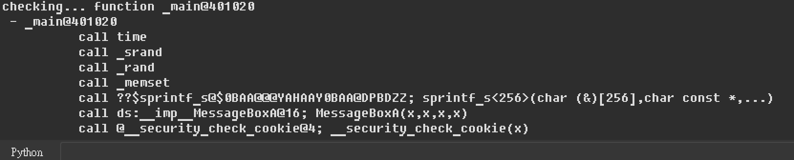
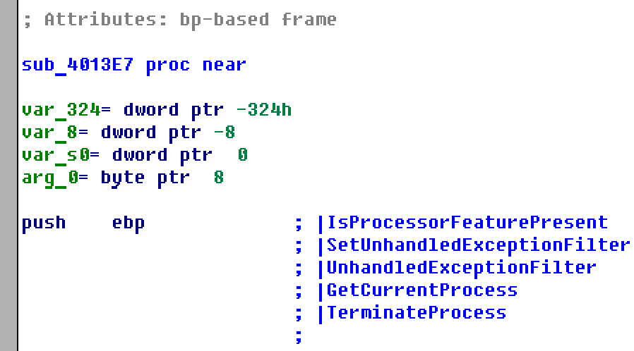

# funcTracker


## IDA 分析上遇到的貧頸

經常利用 IDA 分析 Windows 上執行程式的朋友應該會發現 Windows 在編譯器使用 **/MT** 參數下，編譯出來的程式不會 **直接** 呼叫系統 API，而會由編譯器產生出靜態的客製化函數、其中會包含其中會包含大量不重要的操作（對分析者而言不感興趣）

## 這是什麼?

基於 IDAPython 開發的簡易插件，整個工具基於 Python 2.7 做開發、目前實測支持 IDA Pro 6.8，允許 IDA 使用者快速分析完成一個函數與其呼叫到哪些系統函數，藉此可以大量降低分析成本。

## 安裝方式

將本專案的 **funcTracker.py** 放置到本地 IDA 安裝目錄中的 **plugins** 資料夾中即可。


## 使用方式＆舉個例子

```c
int main()
{
	srand(time(NULL));
	int r = rand() % 10;
	char msg[0x100] = {};
	sprintf_s(msg, "rand = %i", r);
	MessageBoxA(0, msg, "Info", 0);
    return 0;
}
```

今天有一段程式碼如上方所示，透過 Visual C++ 2017 編譯後產生出執行程式，再以 IDA 開啟執行文件分析的函數上。

在希望分析的函數上右鍵點擊「Function Tracker」選項


接著在 Python 指令輸入介面上就可以見到工具分析出來的所有函數呼叫所有函數呼叫結果



並且在函數頭上自動下註記，記錄下這層函數所有調用到的函數


## 實際運用層面

Windows 上的編譯器經常會靜態包入許多客製化的函數，這使得分析者透過 IDA 只會看到一堆匿名的 sub_xxxxxxxx 函數，必須一層一層分析去推測該匿名函數可能是什麼函數的封裝結果。

比方說底下這個函數，sub_4013E7：


現在你只要使用 funcTracker 小工具，即可輕易取得函數呼叫樹狀結果：


並得知這層函數與其他呼叫到的分支函數中是否調用了敏感的系統函數，藉此可以快速篩選需要被分析的需要被分析的函數、降低分析成本。



## 聯絡我

可以對這份專案 [aaaddress1/funcTracker](https://github.com/aaaddress1/funcTracker/) 提出 Issue 或者來信 aaaddress1@chroot.org